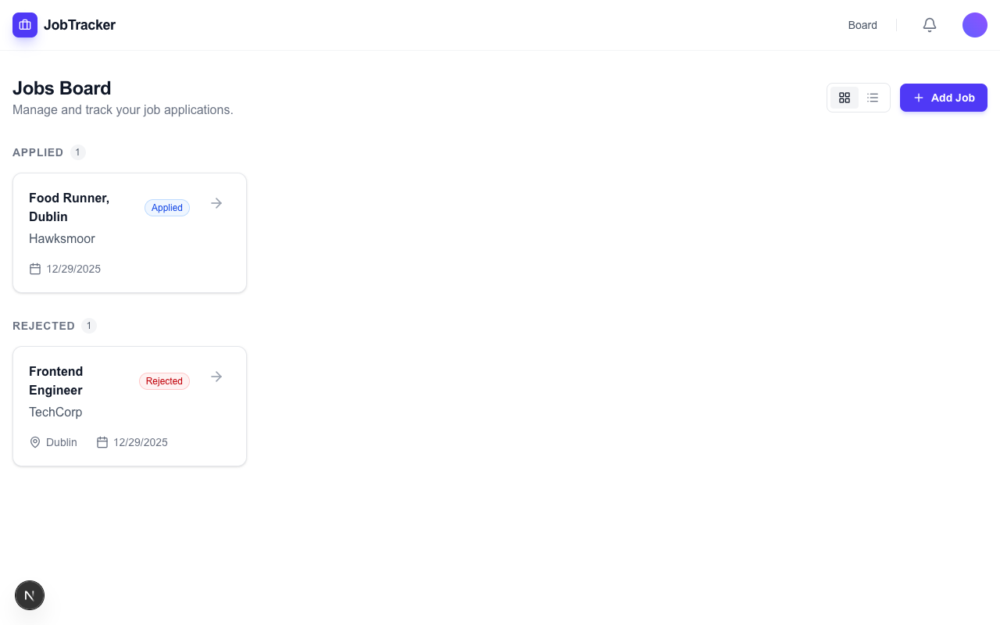
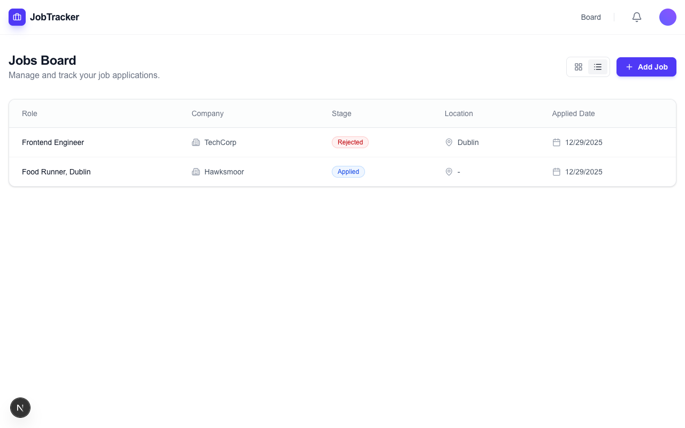
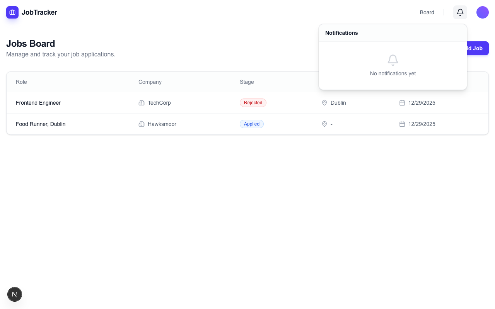

# AI-Powered Job Tracker
A full-stack application to track job applications manually and automatically using AI. It integrates with Gmail to intelligently parse incoming emails (application confirmations, interview invites, rejections) and updates your job board automatically using Google Gemini.
## Features
-   **Smart Automation**: Polling agent reads emails using Gmail API and updates job statuses using Gemini AI.
-   **Intelligent Filtering**: Automatically ignores spam and generic platform notifications (e.g., "Complete your profile").
-   **Kanban Board**: Visualize job applications by stage (Applied, Assessment, Interviewing, Offer, etc.).
-   **Table View**: Switch between Board and Table views for easy data management.
-   **Notifications**: Real-time toast notifications and a persistent Notification Center for updates.
-   **Manual Tracking**: Add jobs and events manually via a clean UI.
## Gallery

<div align="center">
  
  <p><em>Kanban Board for visualizing application progress</em></p>
</div>

<div align="center">
  
  <p><em>Table View for detailed data management</em></p>
</div>

<div align="center">
  
  <p><em>Notification Center & Toasts</em></p>
</div>

## Tech Stack
-   **Frontend**: Next.js 14, Tailwind CSS, Lucide React, Sonner (Toasts).
-   **Backend**: AWS Lambda (Node.js), Amazon DynamoDB, Amazon API Gateway.
-   **Infrastructure**: AWS CDK (Infrastructure as Code).
-   **AI & Integrations**: Google Gemini Flash 1.5, Gmail API.
## Prerequisites
-   **Node.js**: v18 or later.
-   **AWS Account**: Configured with AWS CLI (`aws configure`).
-   **Google Cloud Console Project**:
    -   Enabled **Gmail API**.
    -   Created **OAuth 2.0 Credentials** (Client ID & Secret).
    -   Authorized Redirect URI: `http://localhost:3000` (or your deployed frontend URL).
-   **Google AI Studio**: API Key for Gemini.
## Installation & Setup
### 1. Infrastructure (Backend)
Navigate to the `infra` directory and deploy the AWS stack.
```bash
cd infra
npm install
```
**Deploy with Context Variables:**
The project uses CDK Context for configuration. Open `cdk.json` (or verify it exists in `infra/cdk.json`) and add your secrets to the `context` object:
```json
{
  "context": {
    "googleClientId": "YOUR_GOOGLE_CLIENT_ID",
    "googleClientSecret": "YOUR_GOOGLE_CLIENT_SECRET",
    "googleRedirectUri": "http://localhost:3000/api/auth/callback/google",
    "geminiApiKey": "YOUR_GEMINI_API_KEY",
    // ... other cdk settings
  }
}
```
Then deploy simply by running:
```bash
cdk deploy
```
*Note: After deployment, **copy the `JobTrackerApi` URL** from the terminal output. You will need this for the frontend.*
### 2. Frontend
Navigate to the `frontend/job-tracker-ui` directory.
```bash
cd frontend/job-tracker-ui
npm install
```
**Environment Setup:**
1.  **Proxied API (Recommended)**:
    The project is set up to use a proxy to avoid CORS issues.
    *   Ensure `.env.local` has `NEXT_PUBLIC_API_URL=/api/proxy`.
    *   Open `next.config.ts` and update the `destination` in the `rewrites` function with your deployed API Gateway URL:
    ```typescript
    // frontend/job-tracker-ui/next.config.ts
    {
      source: '/api/proxy/:path*',
      destination: 'https://<YOUR_API_ID>.execute-api.<REGION>.amazonaws.com/dev/:path*', // Update this!
    }
    ```
**Run Locally:**
```bash
npm run dev
```
Open [http://localhost:3000](http://localhost:3000) in your browser.
## Architecture Highlights
*   **`gmail-poller`**: A Lambda function running on a schedule (e.g., daily) that:
    1.  Fetches recent emails (last 2 days).
    2.  Filters out promotions and social updates.
    3.  Uses Gemini AI to decide if an email is relevant to a job application.
    4.  Updates DynamoDB (Create Job, Add Event, Update Stage) or Ignores the email.
*   **Infrastructure as Code**: defined in `infra/lib/infra-stack.ts`.
