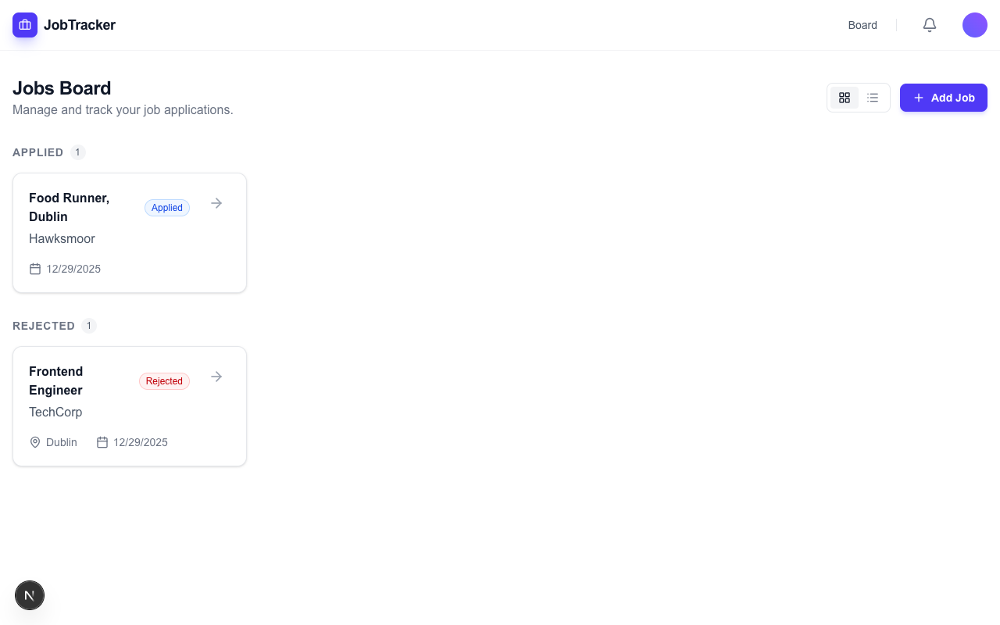
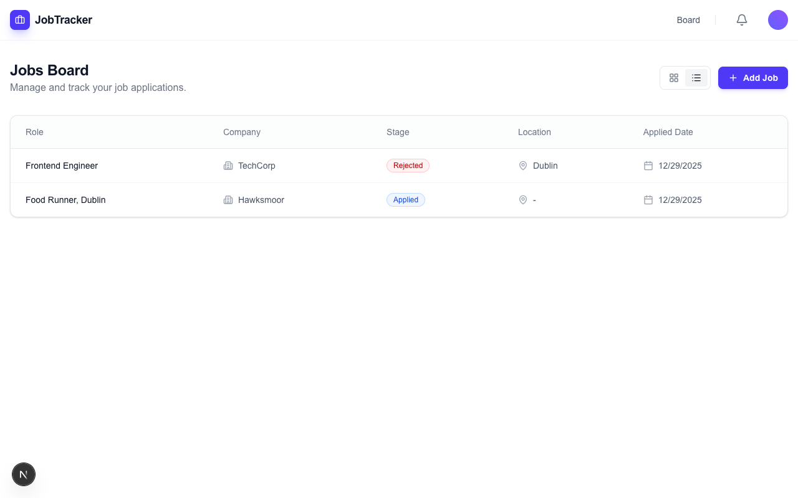
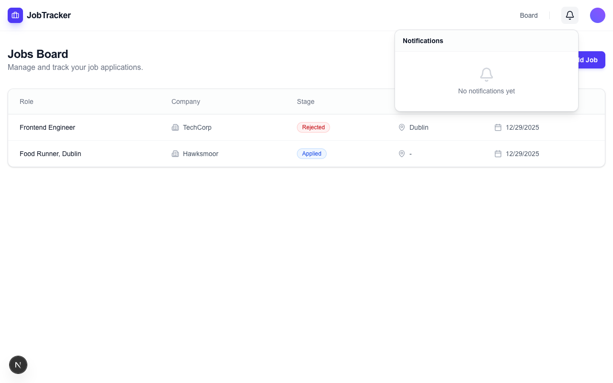

# AI-Powered Job Tracker

## What it does
Manually updating spreadsheets for dozens of job applications is a tedious and error-prone process. The AI-Powered Job Tracker solves this by intelligently monitoring your incoming Gmail messages (such as application confirmations, interview invites, and rejections) and automatically syncing those updates to a centralized Kanban board. It is built for active job seekers who want a streamlined, automated way to track their application pipeline without the overhead of manual data entry.

## How I built it
**Stack**: Next.js 14, AWS Lambda (Node.js), Amazon DynamoDB, AWS CDK, Google Gemini Flash 1.5, Gmail API

**Why these choices?** 
I chose an **AWS Serverless architecture** (Lambda + DynamoDB) because it provides a highly scalable, event-driven infrastructure that fits a background polling workload perfectly, while remaining extremely cost-effective. **Next.js 14** was used to deliver a snappy, responsive frontend featuring both Kanban board and Data Table views. For the intelligence layer, **Google Gemini Flash 1.5** was selected for its fast, context-aware NLP capabilities, allowing the system to accurately filter out noise (like marketing spam) and correctly categorize diverse email templates from dozens of different ATS platforms.

## What was hard
- **Data Quality & Inconsistent ATS Formats**: Job application emails come in wildly different formats from various platforms (Workday, Greenhouse, Lever, etc.). Getting the AI to reliably extract the correct company name, role, and job stage without hallucinating required extensive iterative prompt engineering and context tuning with Gemini.
- **Rate Limiting & Token Optimization**: Continuously polling the Gmail API and passing context to the Gemini API could easily lead to rate limits or high token costs. I solved this by implementing a cursor-based polling mechanism in the Lambda agent to only fetch emails from the last 2 days, and strictly pre-filtering promotional/social emails before they ever reach the LLM.
- **State Synchronization**: Designing the architecture to gracefully handle backend state updates—such as moving an application from "Applied" to "Interviewing" via the automated agent—without accidentally overwriting the user's manual UI edits required robust database design in DynamoDB.

## Results / Impact
- **Time Saved**: Eliminated manual data entry, saving hours of weekly spreadsheet management and tracking during active job searches.
- **Accuracy**: Successfully and intelligently categorized job stages (Applied, Assessment, Interviewing, Rejected) across multiple different employer email templates.
- **Performance**: The serverless Lambda polling architecture processes and categorizes background email batches in under 5 seconds, keeping cloud infrastructure costs at near-zero during idle periods.

---

## Gallery

<div align="center">
  
  <p><em>Kanban Board for visualizing application progress</em></p>
</div>

<div align="center">
  
  <p><em>Table View for detailed data management</em></p>
</div>

<div align="center">
  
  <p><em>Notification Center & Toasts</em></p>
</div>

## Local Setup & Installation

### 1. Infrastructure (Backend)
Navigate to the `infra` directory and deploy the AWS stack.
```bash
cd infra
npm install
```
Add your secrets to the `context` object in `infra/cdk.json`:
```json
{
  "context": {
    "googleClientId": "YOUR_GOOGLE_CLIENT_ID",
    "googleClientSecret": "YOUR_GOOGLE_CLIENT_SECRET",
    "googleRedirectUri": "http://localhost:3000/api/auth/callback/google",
    "geminiApiKey": "YOUR_GEMINI_API_KEY"
  }
}
```
Deploy the stack:
```bash
cdk deploy
```
*Note: After deployment, copy the `JobTrackerApi` URL from the terminal output.*

### 2. Frontend
Navigate to the `frontend/job-tracker-ui` directory.
```bash
cd frontend/job-tracker-ui
npm install
```
**Environment Setup:** Ensure `.env.local` has `NEXT_PUBLIC_API_URL=/api/proxy`. Open `next.config.ts` and update the `destination` in the `rewrites` function with your deployed API Gateway URL.

**Run Locally:**
```bash
npm run dev
```
Open [http://localhost:3000](http://localhost:3000) in your browser.
